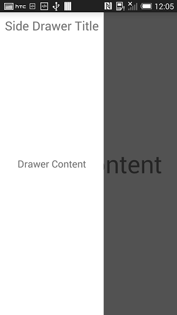

## SideDrawer for Xamarin.Android: Overview Getting Started

**RadSideDrawer** is a component similar to Android's DrawerLayout but it provides many **transitions** out of the box. The transitions are also extensible so users can provide their own custom transitions if necessary.

RadSideDrawer has two main properties you need to set in order to get the full drawer experience. These properties are **MainContent** and **DrawerContent**. They are two separate View objects. The drawer content is displayed beside the main content either through a swipe gesture or via code. When the drawer content is visible, the main content fades out indicating that interaction with it is not possible until the drawer is closed. 

The transitions are groups of animations that are started when the user opens the drawer either through code or gestures.

Here the drawer part is not visible with only the main content showing:


If the user swipes from the left edge to the right, the drawer appears and fades the main content:



Below is a very simple code example that shows the minimum steps required to display RadSideDrawer with some static content:

```C#
protected override void OnCreate (Bundle bundle)
{
	base.OnCreate (bundle);

	SetContentView (Resource.Layout.Main);

	RadSideDrawer drawer = new RadSideDrawer (this);
	drawer.SetMainContent (Resource.Layout.drawer_main_content);
	drawer.SetDrawerContent (Resource.Layout.drawer_side_content);
	
	// There are also MainContent and DrawerContent properties that accept a View directly.

	ViewGroup rootView = (ViewGroup)this.FindViewById (Resource.Id.rootView);
	rootView.AddView (drawer);
}
```

>Please note that SetMainContent() and SetDrawerContent() have two overloads each. One overload accepts a resource id as the argument and the other accepts a View object directly with the resource id overload provided for convenience.
