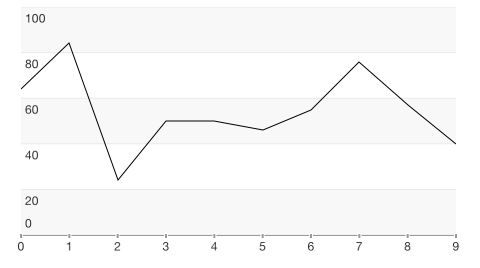
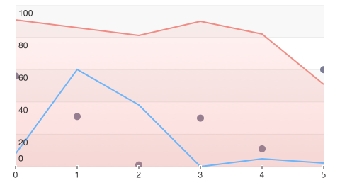

## Chart for Xamarin.iOS: Populating with Data

In order for <code>TKChart</code> to represents data, we should supply this data to it. Following the Model-View-Controller design pattern, the data source mediates between the application's data model (that is, its model objects) and the chart view. The data source provides the chart-view object with the information it needs to construct visualization using different chart types.

<code>TKChart</code> can be bound to a wide variety of data sources. The common way to work with chart-view' data source is to subclass the <code>UIViewController</code> and adopt the <code>TKChartDataSource</code> protocol or subclass the built-in <code>TKChartViewController</code> to manage the data source. Another way is to automate this task using the binding mechanism of <code>TKChart</code> to setup the data source.

## Configure data source using the TKChartDataSource protocol

Following this approach, we supply <code>TKChart</code> with data using a delegate. This works the same way as with <code>UITableView</code>. You should implement the <code>TKChartDataSource</code> protocol and specify the number of series, the number of points in each series, the series objects and the point objects. The <code>TKChartDataSource</code> has two required methods, namely NumberOfSeries and GetSeries.The <code>NumberOfSeries</code> method tells the chart view how many series to display in the plot area, and the <code>GetSeries</code> method provides the series to display. Optional methods allow the data source to configure data points for each series.

Here is a sample subclass of <code>TKChartViewController</code> which will provide TKChart with data points for one <code>TKChartLineSeries</code>:

```C#
public class ChartDocsPopulatingWithData : UIViewController
{
    public ChartDocsPopulatingWithData ()
    {
    }

    public override void ViewDidLoad ()
    {
        base.ViewDidLoad ();

        var chart = new TKChart (CGRect.Inflate (this.View.Bounds, -10, -10));
        this.View.AddSubview (chart);
        chart.DataSource = new ChartDataSource ();
        chart.AutoresizingMask = UIViewAutoresizing.FlexibleWidth | UIViewAutoresizing.FlexibleHeight;
    }

    class ChartDataSource: TKChartDataSource
    {
        Random r = new Random();

        public override nuint NumberOfSeries (TKChart chart)
        {
            return 1;
        }

        public override nuint PointsInSeries (TKChart chart, nuint seriesIndex)
        {
            return 10;
        }

        public override TKChartSeries GetSeries (TKChart chart, nuint index)
        {
            var series = chart.DequeueReusableSeriesWithIdentifier ("series1") as TKChartSeries;
            if (series == null) {
                series = new TKChartLineSeries (null, "series1");
                series.Title = "Series title";
            }
            return series;
        }

        public override ITKChartData GetPoint (TKChart chart, nuint dataIndex, nuint seriesIndex)
        {
            var point = new TKChartDataPoint (new NSNumber (dataIndex), new NSNumber(r.Next (100)));
            return point;
        }
    }
```



## Configure data source using binding to DataPoints collection

Another way to configure <code>TKChart</code> data source is to set up data points for the <code>TKChartSeries</code> object, and using the binding mechanism, the <code>TKChart</code> control will automatically create and set up the built-in <code>TKChartBindDingataSource</code> for you.


Here is a <code>TKChartColumnSeries</code> with an attached collection of data points:

```C#
var chart = new TKChart (CGRect.Inflate (this.View.Bounds, -10, -10));
this.View.AddSubview (chart);
chart.AutoresizingMask = UIViewAutoresizing.FlexibleWidth | UIViewAutoresizing.FlexibleHeight;

var categories = new [] { "Greetings", "Perfecto", "NearBy", "Family Store", "Fresh & Green" };
var values = new [] { 70, 75, 58, 59, 88 };
var dataPoints = new List<TKChartDataPoint> ();
for (int i = 0; i < categories.Length; ++i) {
    dataPoints.Add (new TKChartDataPoint (new NSString (categories [i]), new NSNumber (values [i])));
}

chart.AddSeries (new TKChartColumnSeries (dataPoints.ToArray ()));
```


## Configure data source using binding to properties of model object

In order to support full binding mechanism and minimize the amount of code used to initialize data source with model object of your application, <code>TKChart</code> supports binding to properties of the model object. To use this powerful mechanism, you should describe in pairs the names of <code>TKChartData</code> properties related to the property names of your custom object.

Binding to an array of custom object is quite easy with TKChart. Once your array is created, you just need to set the necessary members to the desired field. In the code snippet below we create one application specific custom object and bind its data to three line series:

```C#
var chart = new TKChart (CGRect.Inflate (this.View.Bounds, -10, -10));
this.View.AddSubview (chart);
chart.AutoresizingMask = UIViewAutoresizing.FlexibleWidth | UIViewAutoresizing.FlexibleHeight;

Random r = new Random ();
var dataPoints = new List<CustomObject> ();
for (int i=0; i<5; i++) {
    CustomObject obj = new CustomObject () {
        ObjectID = i,
        Value1 = r.Next (100),
        Value2 = r.Next (100),
        Value3 = r.Next (100)
    };
    dataPoints.Add (obj);
}

chart.BeginUpdates ();
chart.AddSeries(new TKChartLineSeries(dataPoints.ToArray(), "ObjectID", "Value1"));
chart.AddSeries(new TKChartAreaSeries(dataPoints.ToArray(), "ObjectID", "Value2"));
chart.AddSeries(new TKChartScatterSeries(dataPoints.ToArray(), "ObjectID", "Value3"));
chart.EndUpdates();
```



> TKChart by default creates and sets up axes automatically to support this flexible and codeless binding behavior using the data types in the provided data source. You can always change or replace the axis type for TKChartSeries or change it auto-calculated default range.
