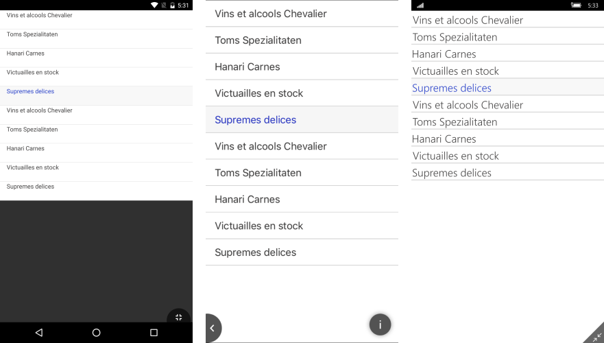

# How to Set a Telerik Theme 

There are a couple of steps you need to take in order to apply the theming on a specific control. You need to:

* [Merge the required ResourceDictionaries](#merge-the-required-resourcedictionaries) 
* [Set the StyleClass property of the control](#set-the-styleclass-on-control-level)

## Merge The Required ResourceDictionaries

In order to apply a **Telerik Theme** for a specific control, you need to merge the required **ResourceDictionaries** in your application:

```XAML
<Application xmlns="http://xamarin.com/schemas/2014/forms"
		 xmlns:x="http://schemas.microsoft.com/winfx/2009/xaml"
		 xmlns:telerikInput="clr-namespace:Telerik.XamarinForms.Input;assembly=Telerik.XamarinForms.Input"
		 xmlns:chart="clr-namespace:Telerik.XamarinForms.Chart;assembly=Telerik.XamarinForms.Chart"
		 xmlns:primitives="clr-namespace:Telerik.XamarinForms.Primitives;assembly=Telerik.XamarinForms.Primitives"
		 xmlns:telerikDataControls="clr-namespace:Telerik.XamarinForms.DataControls;assembly=Telerik.XamarinForms.DataControls"
		 xmlns:telerikCommon="clr-namespace:Telerik.XamarinForms.Common;assembly=Telerik.XamarinForms.Common"
		 xmlns:dataGrid="clr-namespace:Telerik.XamarinForms.DataGrid;assembly=Telerik.XamarinForms.DataGrid"
		 x:Class="Examples.App">
<Application.Resources>

	<!-- Application resource dictionary -->
	<ResourceDictionary>
		<ResourceDictionary.MergedDictionaries>
			<ResourceDictionary MergedWith="telerikCommon:BlueResources"/>
			<ResourceDictionary MergedWith="telerikInput:TelerikThemeStyles"/>
			<ResourceDictionary MergedWith="primitives:TelerikThemeStyles"/>
			<ResourceDictionary MergedWith="chart:TelerikThemeStyles"/>
			<ResourceDictionary MergedWith="telerikDataControls:TelerikThemeStyles" />
			<ResourceDictionary MergedWith="dataGrid:TelerikThemeStyles"/>
		</ResourceDictionary.MergedDictionaries>
	</ResourceDictionary>

</Application.Resources>
</Application>
```

The above snippet shows how to include the dictionaries required for all the controls in the suite. However, if you are not using the full set of controls, you can merge only these dictionaries that are required by the specific element you need.
	
## Set the StyleClass on Control Level

Once you have merged all the required dictionaries, you need to set the **StyleClass** property of the control's instance whose theme you would like to modify. The example below shows how to achieve this on a **RadListView** control:

```XAML
<telerikDataControls:RadListView x:Name="list" StyleClass="TelerikTheme"/>
```

#### Figure 1: RadListView's appearance after setting the StyleClass



## See Also

* [Themes Overview]()
* [How To Create a Custom Theme Based on a Telerik Theme]()
